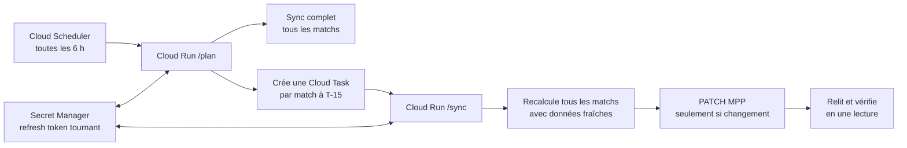

# Mode bot automatisé

Le bot joue tous les matchs dès son premier lancement, puis se relance
automatiquement 15 minutes avant chaque coup d'envoi : il recalcule alors
**tous** les matchs avec les données du moment et ne réécrit que les
pronostics dont la recommandation a changé.

## Architecture



- Le **planificateur** (`/plan`) tourne toutes les 6 heures : il fait un sync
  complet, puis crée une Cloud Task par match, programmée exactement à T-15.
- Chaque **tâche T-15** (`/sync`) refait le calcul complet avec les
  probabilités Polymarket et les parts de paris MPP du moment.
- Un pronostic déjà optimal n'est jamais réécrit ; chaque écriture est
  vérifiée par une relecture immédiate de l'API.
- Si un match est déplacé, l'ancienne tâche ne fait rien de dangereux (le
  sweep ignore les matchs commencés) et le passage suivant du planificateur
  crée la tâche au nouvel horaire.

## Garde-fous

Une écriture exige **simultanément** :

- `MPP_BOT_ALLOW_WRITE=true` (l'image est déployée avec `false`) ;
- un match non commencé, hors du verrou de 60 s avant le coup d'envoi ;
- une association Polymarket non ambiguë avec confiance ≥ 90 % ;
- un marché 1N2 complet et une recommandation calculable ;
- une recommandation différente du pronostic déjà enregistré.

Le kill switch est immédiat : repasser `MPP_BOT_ALLOW_WRITE` à `false`, ou
mettre le planificateur en pause.

Les journaux de `/sync` archivent pour chaque décision les covariables
exactes (probabilités, parts de paris, recommandation, heure de calcul) :
c'est ce qui permet d'auditer le modèle après le tournoi.

## Jetons du compte bot

Créer un compte MPP dédié, le connecter une fois sur le site et rejoindre les
ligues voulues manuellement. Récupérer ensuite `access_token` et
`refresh_token` (DevTools → Réseau → réponse de
`connect.ligue1.fr/oauth/token`) dans :

```
.secrets/mpp-bot-tokens.json   (chmod 600, ignoré par Git)
```

Le jeton d'accès expire ; le bot le rafraîchit automatiquement cinq minutes
avant expiration et persiste le nouveau bundle (fichier local, ou nouvelle
version du secret en mode cloud, car le refresh token peut tourner).

## Utilisation locale

Pour un usage ponctuel, le mode cloud est superflu :

```bash
export MPP_BOT_TOKEN_FILE="$PWD/.secrets/mpp-bot-tokens.json"
PYTHONPATH=src python3.11 -m mpp_optimizer.bot_cli sync           # dry-run
PYTHONPATH=src python3.11 -m mpp_optimizer.bot_cli sync --write   # joue tout
```

Relancer `sync --write` avant les matchs (manuellement ou via cron) reproduit
le comportement du bot cloud.

## Déploiement Google Cloud

Le service tient dans une image Docker (voir `Dockerfile`) exposant trois
endpoints Flask : `/health`, `/plan` et `/sync`. Le script
`scripts/deploy_cloud_bot.sh` crée tout depuis zéro :

```bash
export GCP_PROJECT_ID="mon-projet"
export GCP_REGION="europe-west1"
export MPP_BOT_TOKEN_FILE="$PWD/.secrets/mpp-bot-tokens.json"
./scripts/deploy_cloud_bot.sh
```

Il active les APIs, crée le compte de service, le secret OAuth, la file
Cloud Tasks, le service Cloud Run (privé, **en dry-run**) et le Cloud
Scheduler. Tout est également faisable à la main dans la console ; les
ressources et rôles nécessaires sont exactement ceux du script.

Variables d'environnement du service :

| Variable | Rôle |
|---|---|
| `GCP_PROJECT_ID` | projet hébergeant secret et file |
| `MPP_BOT_TOKEN_SECRET` | nom du secret contenant les jetons |
| `CLOUD_TASKS_LOCATION` / `CLOUD_TASKS_QUEUE` | file des tâches T-15 |
| `MPP_BOT_TASK_SERVICE_ACCOUNT` | compte de service des jetons OIDC |
| `MPP_BOT_SERVICE_URL` | URL publique du service (cible des tâches) |
| `MPP_BOT_ALLOW_WRITE` | `false` par défaut ; `true` pour écrire |
| `MPP_BOT_LEAD_MINUTES` | avance sur le coup d'envoi (défaut 15) |
| `MPP_BOT_MIN_CONFIDENCE` | seuil d'association Polymarket (défaut 0.90) |

### Mise en service prudente

1. Déployer, déclencher le planificateur, lire les journaux : tout doit être
   en `"mode": "dry-run"` avec `errors: 0` ;
2. vérifier dans Cloud Tasks que chaque match a sa tâche à T-15 ;
3. passer `MPP_BOT_ALLOW_WRITE=true` ;
4. le passage suivant joue tous les matchs d'un coup, puis le régime de
   croisière s'installe : recalcul complet toutes les 6 h et à chaque T-15.

### Incidents courants

| Symptôme | Comportement | Action |
|---|---|---|
| Jeton d'accès expiré | refresh automatique | aucune |
| Refresh token invalide | erreur, aucune écriture | reconnecter le compte bot, nouvelle version du secret |
| Marché Polymarket absent ou ambigu | match ignoré proprement | corriger un alias d'équipe si besoin |
| Match déplacé | ancienne tâche sans effet | la tâche au nouvel horaire arrive au prochain plan |
| Écriture non confirmée | erreur, retry de la tâche | inspecter les journaux |
